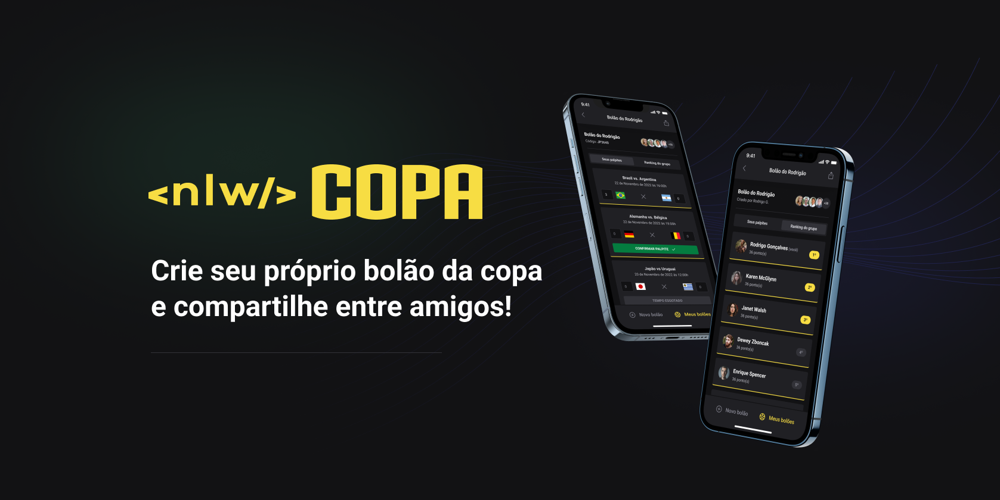

<p align="center">
  
</p>

<p align="center">
  
  <a href="LICENSE"></a>
</p>

## 💻 Projeto

Aplicação para participar de bolões da Copa do Mundo 2022.

## ✨ Tecnologia

- [TypeScript](https://www.typescriptlang.org/)
- [React](https://reactjs.org/)
- [Next JS](https://nextjs.org/)
- [Fastify](https://www.fastify.io/)
- [Prisma](https://www.prisma.io/)
- E muitas outras…

## :rocket: Como instalar e executar:

```bash
  git clone https://github.com/brunoinx/nlw-copa-mobile.git; // ALTERAR

  cd web;
  yarn or npm install (install all dependencies);
  yarn dev or npm run dev (Run to Project);
```

## 🔖 Layout

Você pode visualizar o layout do projeto através do link abaixo:

- [Layout](https://www.figma.com/community/file/1169028343875283461)

Lembrando que você precisa ter uma conta no [Figma](http://figma.com/).

## 📝 License

Esse projeto está sob a licença MIT. Veja o arquivo [LICENSE](LICENSE) para mais detalhes.

---

<p align="center">
  Feito durante a semana NLW rocketseat.
</p>
